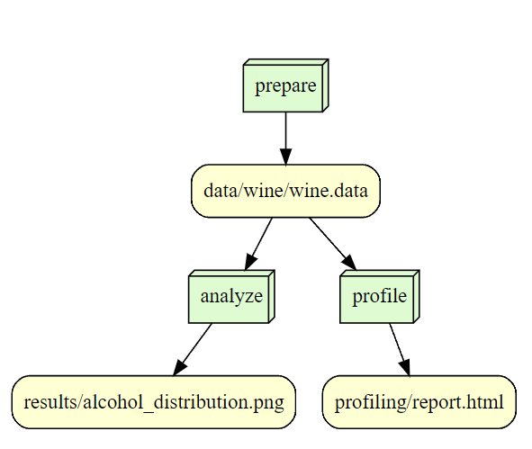

# is-477-fall2023-final-project
## Overview
In this project, part of the IS-477 course, I delve into the intricacies of the renowned wine dataset from the UCI Machine Learning Repository. My aim is to apply a suite of data management techniques and analytical methods learned throughout the course, encompassing data acquisition, profiling, analysis, and visualization.

Key components of the project include:
Data Acquisition and Integrity Checks: We programmatically downloaded the wine dataset, ensuring its authenticity and integrity by computing and verifying its SHA-256 hash.
Data Profiling with ydata-profiling: To gain initial insights, we profiled the dataset using ydata-profiling, generating an HTML report that explores various statistical properties of the data.
Analytical Insights and Visualization: My analysis focused on uncovering patterns and relationships within the dataset. We created visualizations to illustrate these findings, providing a clearer understanding of the characteristics that distinguish each wine cultivar.
## Analysis
My analytical exploration of the wine dataset led to insightful discoveries, particularly regarding the alcohol content distribution across the wine samples. The visualization, a histogram of alcohol content, reveals a roughly normal distribution with a slight right-skew, indicating that while most wines have an alcohol percentage around the central range of 12.5% to 13.5%, there are a few with higher alcohol content. This suggests variability in fermentation processes or grape maturity levels among the different cultivars. The distribution's shape and spread provide a foundational understanding of the dataset's characteristics, which is instrumental for further in-depth analyses, such as clustering wines based on alcohol content or correlating alcohol levels with other chemical properties.
## Workflow

## Reproducing
Here are instructions for you to set up your enviroment and run the script

### Prerequisites

Ensure you have Python 3.x installed on your machine.
If you decide to use Docker:
Install Docker Desktop on your machine.
Create a Docker Hub account if you don't already have one.

### 1. Clone the Repository
First, clone the repository to your local machine:
git clone https://github.com/YeYuanFrancis/is-477-fall2023-final-project.git
cd is-477-fall2023-final-project

### 2. Set Up the Environment
Create and activate a virtual environment, and install the required dependencies:

Create a virtual environment (Windows)
python -m venv .venv
.venv\Scripts\activate

Create a virtual environment (macOS/Linux)
python3 -m venv .venv
source .venv/bin/activate

Install dependencies
pip install -r requirements.txt

### 3. Download and Prepare the Data
Run the prepare_data.py script to download and prepare the dataset:

python scripts/prepare_data.py
This script will download the dataset and perform initial preprocessing steps, saving the processed data in the data directory.

### 4. Generate the Data Profiling Report
To generate a profiling report of the dataset, run:

python scripts/profile.py
This will create a detailed data profiling report and save it as profiling/report.html.

### 5. Conduct the Analysis
Execute the analysis script to perform the data analysis:

python scripts/analysis.py
This will run the analysis defined in analysis.py and save the results in the results directory.

### 6. Run the Complete Workflow with Snakemake
Alternatively, you can run the entire workflow using Snakemake:

snakemake --cores 1
This command will execute the entire workflow, from data preparation to analysis, as defined in the Snakefile.

## Software License

This project is licensed under the MIT License. By choosing it, I hope to give back to the open-source community and let people use the software for free. 

This license is Permissive. The MIT License is easy to understand and lets anyone use, change, and share the program. For its Compatibility, A lot of other agreements work with the MIT License, which makes it easier to work with other open-source projects. It does not have Strong Copyleft If you make changes to something using the MIT License, you don't have to share it under the same license. This is different from licenses that have strict copyleft rules. This gives us more options for how to use and improve it in the future. It is widely used: The MIT License is a well-known license in the open-source world, and it gives people some peace of mind that the rules will be clear and followed.

## Data License

The data and models in this repository are licensed under the Creative Commons Attribution 4.0 International License (CC BY 4.0). By using the CC BY 4.0 License, I hope to make it easier for people to share data that can be used upon, while still making sure that the original makers get credit. 

With its attribution, the license says that people who use your data and models must give you credit, link back to the license, and say if they made any changes. This makes sure that people who contributed are properly thanked. CC BY 4.0 is very liberal, like the MIT License for our software. It lets both academic and business users use, change, and share the licensed data. The license can be used anywhere in the world, even if your country doesn't have copyright rules that protect it.
